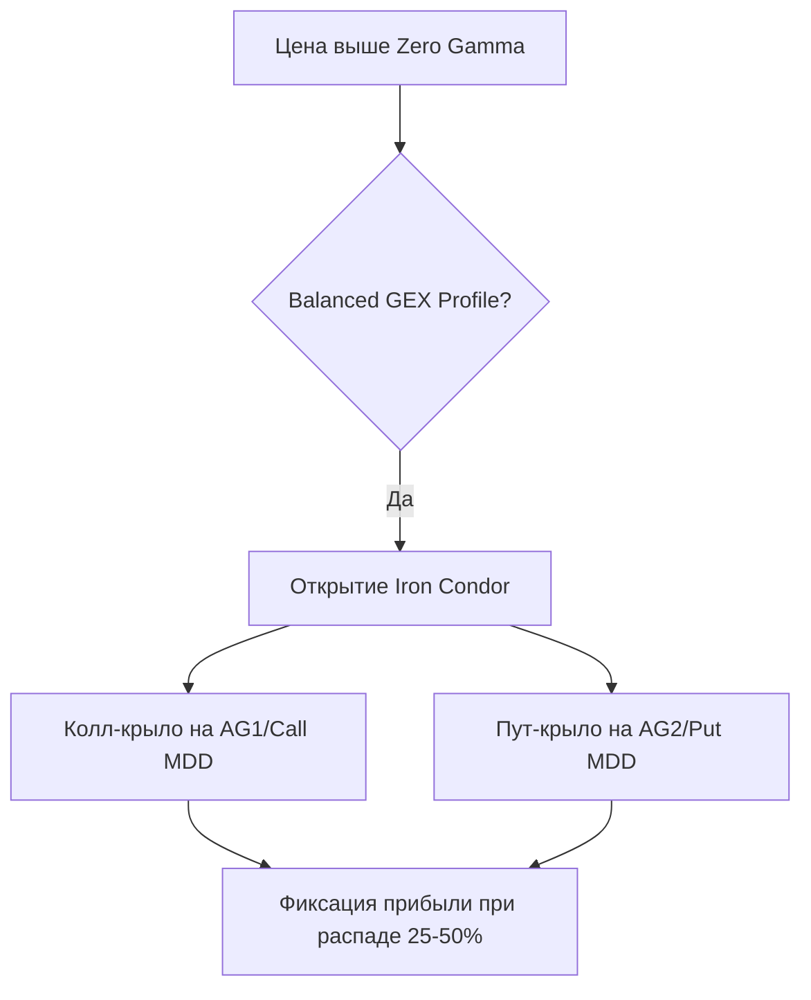

# Полное руководство по опционной торговой стратегии GEX: Логика маркет-мейкера, сетапы и управление рисками

Данное руководство представляет собой глубокий синтез торговой логики, паттернов анализа и методов принятия решений на основе GEX-уровней и поведения маркет-мейкеров (дилеров). Информация извлечена и структурирована на основе анализа материалов и транскриптов обучающих и еженедельных выпусков автора стратегии.

---

## 1. Философия рынка и механика рехеджирования маркет-мейкеров

В основе стратегии лежит понимание того, что современный фондовый рынок (в частности, индекс S&P 500 / SPX) в значительной степени управляется не фундаментальными факторами, а **потоками хеджирования дилеров (маркет-мейкеров)**. Около 60% объема торгов опционами приходится на контракты с нулевой датой экспирации (**0 DTE**), что заставляет дилеров ежедневно совершать сделки с базовым активом на миллиарды долларов.

### Дилер как пассивный контрагент
Маркет-мейкеры (дилеры) обязаны обеспечивать ликвидность — продавать опционы Call и Put клиентам (фондам, спекулянтам), когда те их покупают. Дилеры не занимаются направленной торговлей и не пытаются угадать направление цены. Их цель — оставаться **дельта-нейтральными**, зарабатывая исключительно на комиссии и спреде. 

> [!NOTE]
> **Дельта ($\Delta$)** опциона показывает, насколько изменится его цена при изменении цены базового актива на $1.
> Если клиент покупает опцион Call с $\Delta = 0.50$ (эквивалент 50 акций), дилер продает этот Call и оказывается в короткой позиции по дельте. Чтобы захеджироваться, дилер обязан **купить 50 акций базового актива**.

### Положительная гамма (+GEX) и подавление волатильности
Когда рынок находится в зоне **положительной гаммы (Positive Gamma)**, дилеры находятся в режиме *Long Gamma*. 
* **Поведение дилеров:** При росте цены базового актива дельта их опционного портфеля растет, и для восстановления нейтральности они вынуждены **продавать фьючерсы/акции**. При падении цены дельта падает, и они вынуждены **покупать фьючерсы/акции**.
* **Рыночный эффект:** Сделки дилеров совершаются *против движения рынка*. Дилеры скупают просадки и гасят восходящие импульсы. Рынок становится "вязким", волатильность сжимается, преобладает флэт и возврат к среднему (Mean Reversion). VIX в такой среде стабильно снижается.

### Отрицательная гамма (-GEX) и ускорение волатильности
Когда рынок опускается в зону **отрицательной гаммы (Negative Gamma)**, дилеры переходят в режим *Short Gamma*.
* **Поведение дилеров:** При падении цены базового актива дельта проданных ими Put-опционов стремительно растет в отрицательную сторону. Чтобы избежать колоссальных убытков, они вынуждены **агрессивно продавать базовый фьючерс по тренду**. При росте рынка они вынуждены покупать.
* **Рыночный эффект:** Сделки дилеров совершаются *по направлению движения рынка*. Продажи порождают новые продажи, выступая "топливом" для тренда. Рынок становится импульсным, происходят резкие обвалы, паника и взрывной рост волатильности (VIX растет).

---

## 2. Ключевые аналитические инструменты и метрики дашборда

Для анализа дистрибуции опционной ликвидности используются следующие метрики и визуальные слои на графике:

1. **Zero Gamma (Gamma Flip / Точка перелома):**
   Цена, при которой суммарная нетто-гамма дилеров по всем страйкам равна нулю. Это главный водораздел рыночных фаз. Выше нее рынок спокоен и стабилен; ниже нее — волатилен и склонен к обвалам.
2. **Absolute Gamma (AG / Абсолютная гамма):**
   Суммарный объем гаммы на страйке без учета знака (на графике отображается фиолетовыми пунктирными линиями `AG1`, `AG2`). Крупные скопления AG выступают мощнейшими уровнями поддержки/сопротивления (стенами) или магнитами, притягивающими цену.
3. **Line of Max Power (LMP / Линия Максимальной Силы):**
   Динамический центр гравитации (главный "магнит" для цены). Если цена значительно отклоняется от LMP, она стремится вернуться к ней.
4. **Power Zone (PZ / Зона Силы):**
   Динамический коридор (выделяется желтой областью на графике), отражающий концентрацию открытого интереса и проторгованных объемов. Сигнализирует о границах ожидаемого диапазона движения внутри дня. Если Power Zone начинает перестраиваться (накапливаться) на новом страйке в течение дня, это ранний сигнал скорого смещения магнита LMP и цены.
5. **Sigma-границы (R68 / R95 Zones):**
   Границы ожидаемого внутридневного хода в 1 стандартное отклонение (вероятность 68%) и 2 стандартных отклонения (вероятность 95%), рассчитанные по формуле Блэка-Шоулза на основе подразумеваемой волатильности опционов. Выход цены за границу R68 указывает на статистическую аномалию и готовящийся откат.

---

## 3. Паттерны анализа и логика принятия решений

### Метод "Профессионалы vs Толпа"
* **Открытие сессии (первые 30–60 минут):** В это время рынок совершает хаотичные движения под влиянием толпы и отработки утренних новостей. Алгоритмы дашборда накапливают данные.
* **Принятие решений:** Входить в сделки рекомендуется спустя 30–60 минут после открытия, когда контуры Power Zone и LMP стабилизируются. Профессиональные игроки формируют объемы, которые зажимают цену в рамки Power Zone. Если LMP и Power Zone неподвижны, это подтверждает флэт. Если они смещаются, планируется сделка по тренду.

### Приоритет кредитных стратегий (продажа премий)
При торговле отскоков от уровней автор стратегии **категорически отказывается от покупки опционов (или фьючерсов/CFD)**.
* При покупке опциона (например, Buy Put) трейдер должен угадать не только направление, но и силу движения, а также успеть до экспирации. Время (Theta) работает против покупателя.
* Вместо этого используются **кредитные спреды (Bear Call / Bull Put)**. Продавая спред у сильной границы (например, Call-спред у уровня AG Resistance), трейдер делает ставку на то, что **цена не пройдет этот уровень**. При этом неважно, упадет ли цена глубоко или просто будет стоять на месте — при любом раскладе опцион сгорит, и позиция принесет 100% прибыли.

### Фильтрация ложных пробоев уровней
* Если цена пробивает уровень GEX, но выше него объемы Absolute Gamma резко снижаются, а Power Zone не расширяется — этот пробой ложный. У рынка нет "топлива" расти дальше, и дилеры быстро вернут цену назад.
* Если по мере движения цены вперед объемы Absolute Gamma на следующих страйках нарастают, а Power Zone расширяется — пробой истинный, маркет-мейкеры перестраивают свои хеджи (происходит гамма-сквиз).

---

## 4. Четыре основных торговых сетапа

### Сетап 1: Работа в диапазоне (Range Play — Iron Condor)
Применяется при сбалансированном профиле гаммы, когда цена зажата между крупными кластерами положительного/отрицательного GEX и Absolute Gamma, а внешние границы защищены уровнями `AG1` и `AG2`.

* **Условия входа:** Рынок открылся выше Zero Gamma. Вверху и внизу от цены находятся крупные столбики GEX и линии Absolute Gamma. LMP стабильна посередине.
* **Конструкция:** **Iron Condor** (Железный Кондор).
  - *Колл-крыло:* Продажа Call на уровне сопротивления `AG1` / `Call MDD`, покупка защитного Call на 5–10 пунктов выше.
  - *Пут-крыло:* Продажа Put на уровне поддержки `AG2` / `Put MDD`, покупка защитного Put на 5–10 пунктов ниже.
* **Управление сделкой:** Позиция открывается в начале недели. Ее не нужно держать до экспирации в пятницу. Как только временной распад приносит **25% – 50% от максимального кредита**, позиция закрывается.

---

### Сетап 2: Отскок от уровней поддержки/сопротивления (S/R Bounce)
Применяется для контртрендовой торговли от ключевых дневных границ при подходе к уровням `MDD` или статистическим экстремумам.

> [!TIP]
> Идеальный сигнал возникает при **конфлюэнции (совпадении)** трех факторов на одном ценовом уровне:
> 1. Крупный кластер Absolute Gamma (`AG`).
> 2. Граница зоны волатильности `R68` или `R95` (перекупленность/перепроданность).
> 3. Дневной уровень `Daily MDD` (предел убытка продавцов опционов).

* **Условия входа:** Цена импульсно подходит к совпадению уровней (например, `Daily Call MDD` + граница `R68` + `AG1`). 
* **Конструкция:** **Bear Call Spread** (для шорта) или **Bull Put Spread** (для лонга) с экспирацией в тот же день (0 DTE) или в пятницу (Weekly).
  - *Продажа (Short):* Страйк прямо на уровне сопротивления/поддержки.
  - *Покупка (Long):* Страйк на 5 пунктов дальше (страховка).
* **Управление сделкой:** За счет того, что страйки находятся максимально близко к цене, позиция дает привлекательное соотношение риска к прибыли. Если цена пробивает уровень и закрепляется за ним, позиция немедленно закрывается с минимальным убытком. Если уровень удерживается — забирается 100% премии.

---

### Сетап 3: Возврат к магниту LMP (Reversion to LMP)
Трейдинг направленного возврата цены к центру опционной гравитации при ее экстремальных отклонениях.

* **Условия входа:** Цена в течение дня отклонилась от Line of Max Power (LMP) к внешним уровням поддержки/сопротивления. При этом сама линия LMP в дашборде остается неподвижной на прежнем страйке. Это указывает на то, что профессиональные игроки не сдвигают свои ожидания, и отклонение цены носит временный характер.
* **Конструкция:** Покупка направленного спреда (Bull Call / Bear Put) или открытие **Iron Butterfly** (Железная Бабочка) с вершиной (точкой максимальной прибыли) ровно на уровне LMP.
* **Управление сделкой:** Цель — возврат цены к LMP. Как только цена возвращается к линии магнита, сделка фиксируется. Если в течение дня LMP перестраивается вслед за ценой — сетап отменяется, сделка закрывается в безубыток или с минимальным убытком.

---

### Сетап 4: Хеджированные направленные комбинации (Hedged Directional Combos)
Фирменный паттерн автора, сочетающий сбор премии от флэта с "бесплатной" направленной ставкой на случай резкого падения рынка (гамма-сквиза).

* **Условия входа:** Наличие несимметричного профиля GEX. Снизу, на медвежьей территории (под Zero Gamma), сосредоточен гигантский кластер Absolute Gamma (например, на страйке 740 при текущей цене 760). Это указывает на то, что в случае пробоя Zero Gamma падение будет стремительным и глубоким.
* **Конструкция (Связка):**
  - **3–4 контракта Iron Condor** (сбор премии в рамках ожидаемого флэта).
  - **1 контракт Calendar Put Spread** (или **Broken-Wing Put Butterfly**) со страйком на уровне нижнего магнита (например, 740).
* **Экономика связки:**
  - *Сценарий А (Флэт / Умеренный рост):* Кондоры приносят максимальную прибыль. Календарный пут-спред сгорает и приносит максимальный убыток. Но поскольку премия от 3–4 кондоров существенно больше стоимости 1 календарного спреда, суммарная связка закрывается в хорошем плюсе. Ставка на падение была полностью профинансирована рынком.
  - *Сценарий Б (Обвал / Гамма-сквиз):* Кондоры по путовой стороне уходят в убыток. Однако Calendar Put Spread на уровне магнита (740) из-за взрывного роста волатильности и падения цены приносит гигантскую прибыль (до 500-1000% на вложенный капитал), которая с лихвой перекрывает все убытки по кондорам и выводит портфель в сверхприбыль.

#### Пример Broken-Wing Put Butterfly (BWB):
Для защиты от падения собирается бабочка со сломанным крылом:
* Покупка 1 Put на страйке 679 (ближе к цене).
* Продажа 2 Put на страйке 670 (центр поддержки / магнит).
* Покупка 1 Put на страйке 660 (дальнее страховочное крыло).

*Расстояние между верхним и средним страйками (9 пунктов) меньше расстояния между средним и нижним (10 пунктов).* Это делает конструкцию очень дешевой (иногда бесплатной с чистым кредитом) и защищает от убытка при слишком глубоком падении.

---

## 5. Риск-менеджмент и правила управления капиталом

Для стабильной торговли по стратегии GEX необходимо соблюдать строгие правила управления сделками:

1. **Правило 4–5% в неделю:**
   Автор стратегии рекомендует ориентироваться на еженедельную доходность портфеля в размере 4–5% от общего депозита. При достижении этой цели все опционные конструкции закрываются, независимо от того, сколько дней осталось до экспирации. Благодаря сложному проценту, стабильные 4% в неделю превращают депозит за год в двух- или трехкратный размер с минимальными просадками.
2. **Запрет на удержание до экспирации:**
   Никогда не удерживайте незахиджированные опционные спреды до последних часов пятницы. В последние часы перед экспирацией гамма опционов становится экстремальной (эффект "Gamma Risk"), и малейшее движение цены базового актива может уничтожить всю накопленную прибыль. Закрывайте позиции при достижении 70–80% от максимального профита или при первой опасности пробоя зон.
3. **Хеджирование волатильности:**
   Календарные и диагональные спреды обладают положительной Вегой (Long Vega). Это означает, что при росте волатильности (падении рынка) они дорожают быстрее, чем линейные опционы. Используйте их для компенсации короткой веги в Iron Condor.
4. **Тайминг внутридневного входа:**
   При торговле 0 DTE никогда не входите в рынок в первые 15 минут. Дождитесь закрытия первого получасового или часового интервала, сопоставьте уровни `Daily MDD` с границами `Power Zone` и LMP и только затем открывайте позицию.

---

### Резюме по торговым сигналам в зависимости от GEX-режима:

| Метрика / Ситуация | Режим +GEX (выше Zero Gamma) | Режим -GEX (ниже Zero Gamma) |
| :--- | :--- | :--- |
| **Характер рынка** | Медленный боковик, вязкие движения | Быстрые направленные тренды, импульсы |
| **Волатильность (VIX)** | Снижается или стабильно низкая | Стремительно растет |
| **Основное поведение дилеров** | Контртрендовый хедж (Mean Reversion) | Трендовый хедж (Momentum) |
| **Приоритетные сетапы** | Iron Condor, Credit Spreads, Reversion to LMP | Breakout trades, Calendar Put Spreads, BW Butterflies |
| **Действия на уровнях MDD** | Открытие контртрендовых кредитных спредов | Пробойные стратегии, закрытие контртрендовых позиций |
