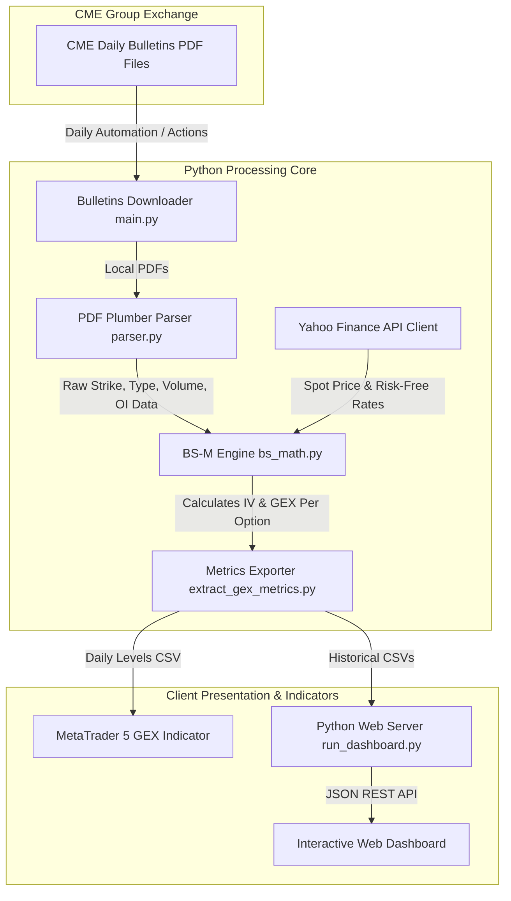

# 📊 CME Options Gamma Exposure (GEX) Parser & Analytics Pipeline (`Options`)

[](https://www.python.org/)
[](https://opensource.org/licenses/MIT)
[](https://www.metatrader5.com/)

A professional quantitative analytical pipeline designed to harvest daily CME (Chicago Mercantile Exchange) option bulletin data, calculate contract-by-contract Implied Volatility and Gamma Exposure (GEX) via the **Black-Scholes-Merton model**, and output trading levels for integration with **MetaTrader 5 (MQL5)** indicators and a custom web dashboard.

Supported assets: **EURUSD**, **GBPUSD**, **USDCAD**, **Gold (XAUUSD)**, **Nasdaq-100 (NDX)**, **S&P 500 (SPX)**, and **Bitcoin (BTCUSD)** options.

---

## 🏗️ System Architecture & Data Flow

The system acts as a bridges between CME exchange bulletins, quantitative calculation engines, and client terminals.



---

## 🔬 Mathematical Framework & Calculations

The pipeline calculates the systemic market impact of market maker hedging requirements at specific options strikes.

### 1. Black-Scholes-Merton Options Gamma
The option Gamma ($\Gamma$) represents the rate of change in Delta ($\Delta$) with respect to the underlying spot price ($S$):

$$\Gamma = \frac{e^{-q t} N'(d_1)}{S \sigma \sqrt{t}}$$

Where:
* $d_1 = \frac{\ln(S/K) + (r - q + \sigma^2/2)t}{\sigma \sqrt{t}}$
* $N'(x) = \frac{1}{\sqrt{2\pi}} e^{-x^2/2}$ is the standard normal probability density function.
* $K$ is the option strike price.
* $r$ is the risk-free interest rate (T-Bill yields).
* $q$ is the dividend yield (or foreign risk-free rate for currency options).
* $t$ is the annualized time to expiration.
* $\sigma$ is the option's Implied Volatility (IV).

### 2. Implied Volatility (IV) Solver
Since IV cannot be solved analytically, the engine implements a numerical solver using the **Newton-Raphson method** to find $\sigma$ such that the theoretical option price matches the market premium ($C_{mkt}$ or $P_{mkt}$):

$$\sigma_{n+1} = \sigma_n - \frac{f(\sigma_n)}{\text{Vega}(\sigma_n)}$$

Where $f(\sigma) = \text{BS}(\sigma) - \text{Premium}_{mkt}$ and $\text{Vega}(\sigma) = S e^{-q t} \sqrt{t} N'(d_1)$.

### 3. Net Gamma Exposure (GEX) Calculation
Market makers adjust their spot exposure to remain delta-neutral. The total dollar value of Gamma exposure at each strike is accumulated:

$$\text{Net GEX} = \text{Open Interest} \times \Gamma \times S^2 \times \text{Multiplier} \times \text{Sign}$$

Where:
* **Multiplier**: Contract sizing unit (e.g., 100 for SPX, 125,000 for EUR option).
* **Sign**: $+1$ for Call options (assumed market maker long), $-1$ for Put options (assumed market maker short).
* **Gamma Flip**: The price level where cumulative net GEX changes polarity (shifts from positive "volatility-dampening" to negative "volatility-amplifying" environment).

---

## 📂 Project Structure

```text
.
├── src/
│   ├── parser.py              # CME PDF option bulletins parser using coordinates & regex
│   ├── bs_math.py             # Math module: BSM price, Vega, Newton-Raphson IV solver, and GEX
│   └── extract_gex_metrics.py # Aggregates option chains, calculates cumulative GEX levels
├── Dashboard/                 # Local Web Dashboard
│   ├── run_dashboard.py       # Python http.server wrapper serving JSON APIs
│   ├── app.js                 # Chart.js frontend visualization script
│   ├── style.css              # Custom dashboard dark theme styles
│   └── index.html             # Dashboard frontend frame
├── CME_GEX_Levels_Indicator.mq5 # Custom MetaTrader 5 indicator for real-time charts
├── main.py                    # Main pipeline entry point
├── .env.example               # Environmental configuration templates
├── requirements.txt           # Python library dependencies
└── README.md                  # Documentation and setup guide
```

---

## 🚀 Installation & Local Run

### 1. Setup Python Environment
Clone this repository and install the dependencies locally:

```bash
pip install -r requirements.txt
```

### 2. Generate Daily Levels
Run the main script to download today's bulletins, parse options tables, and run GEX calculations:

```bash
python main.py
```
Generated outputs will be saved as CSV files inside the `data/` folder.

### 3. Run the Web Dashboard
Launch the lightweight embedded server to view options distribution profiles:

```bash
python Dashboard/run_dashboard.py
```
Open `http://localhost:8080` in your web browser.

---

## 📈 MetaTrader 5 (MT5) Integration

The MT5 indicator loads the calculated levels directly from the data output directories to visualize high-liquidity market-maker walls on your chart.

### Step 1. Enable GitHub WebRequests in MT5
1. In MT5, navigate to **Tools** -> **Options** (`Ctrl + O`).
2. Go to the **Expert Advisors** tab.
3. Check the **"Allow WebRequest for listed URL:"** checkbox.
4. Add these addresses to the list:
   * `https://raw.githubusercontent.com`
   * `https://api.github.com`
5. Click **OK**.

### Step 2. Compile and Attach the Indicator
1. Copy `CME_GEX_Levels_Indicator.mq5` into your MT5 terminal data folder: `/MQL5/Indicators/`.
2. Open **MetaEditor** (`F4`), open the indicator file, and click **Compile** (`F7`).
3. Attach `CME_GEX_Levels_Indicator` to your **EURUSD**, **GBPUSD**, or stock index chart.
4. In the Inputs tab, configure:
   * **GitHub Username**: `circlealgorythm`
   * **GitHub Repository**: `Options`
   * **GitHub Token**: Your personal access token (PAT) for private repo security.
