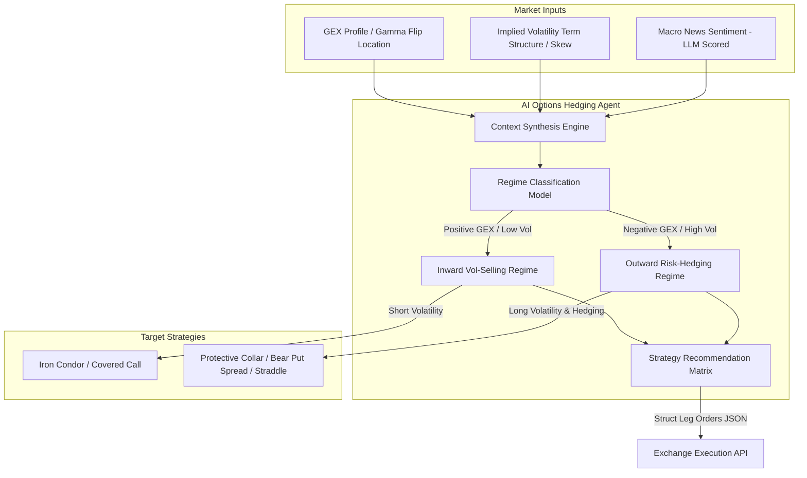

# 📊 Quantitative Option Analytics & AI-Driven Risk Hedging Engine (`Options`)

[](https://www.python.org/)
[](https://www.metatrader5.com/)
[](https://en.wikipedia.org/wiki/Black%E2%80%93Scholes_model)
[](https://deepmind.google/technologies/gemini/)

An enterprise-grade quantitative options analytics platform designed to parse high-frequency exchange bulletins (CME Group), calculate real-time contract-level Greek exposures via the **Black-Scholes-Merton (BSM)** formulation, and orchestrate an **AI-driven options strategy advisor** for automated risk hedging.

The engine parses raw options data for **EURUSD**, **GBPUSD**, **USDCAD**, **Gold (XAUUSD)**, **Nasdaq-100 (NDX)**, and **S&P 500 (SPX)**, exporting real-time Gamma profiles to **MetaTrader 5 (MQL5)** visual indicators and interactive web-based dashboards.

---

## 🔬 Mathematical Core & Options Greeks Model

The core computational engine (`src/bs_math.py`) models market liquidity under the assumption of market maker delta-neutral hedging behavior.

### 1. The Black-Scholes-Merton Options Pricing Model
For underlying assets paying a continuous dividend yield $q$ (or foreign interest rate in currency options), the theoretical pricing of European calls ($C$) and puts ($P$) is defined as:

$$C(S, t) = S e^{-q t} N(d_1) - K e^{-r t} N(d_2)$$

$$P(S, t) = K e^{-r t} N(-d_2) - S e^{-q t} N(-d_1)$$

Where:
* $d_1 = \frac{\ln(S/K) + \left(r - q + \frac{\sigma^2}{2}\right)t}{\sigma \sqrt{t}}$
* $d_2 = d_1 - \sigma \sqrt{t}$
* $S$ is the spot price of the underlying asset.
* $K$ is the option strike price.
* $t$ is the annualized time to maturity.
* $r$ is the risk-free rate of return.
* $q$ is the dividend yield (or foreign interest rate).
* $\sigma$ is the implied volatility of the option.
* $N(\cdot)$ is the cumulative standard normal distribution function.

### 2. Numerical Implied Volatility (IV) Solver
Since implied volatility cannot be expressed analytically, the engine employs a high-performance **Newton-Raphson iterative solver**. The solver minimizes the difference between the theoretical BSM price and the observed market premium $U_{mkt}$:

$$\sigma_{n+1} = \sigma_n - \frac{\text{BS}(\sigma_n) - U_{mkt}}{\text{Vega}(\sigma_n)}$$

Iterative updates run until $|\text{BS}(\sigma_n) - U_{mkt}| < \epsilon$ (where $\epsilon = 10^{-5}$). 
The derivative of option price with respect to volatility, **Vega**, is calculated as:

$$\text{Vega} = S e^{-q t} \sqrt{t} N'(d_1)$$

Where $N'(x) = \frac{1}{\sqrt{2\pi}} e^{-x^2/2}$ is the standard normal probability density function.

### 3. Net Gamma Exposure (GEX) Calculation
Option Gamma ($\Gamma$) measures the rate of change of Delta ($\Delta$) with respect to the spot price:

$$\Gamma = \frac{e^{-q t} N'(d_1)}{S \sigma \sqrt{t}}$$

The aggregate systemic risk generated by market maker delta-hedging at each option strike price is defined by **Gamma Exposure (GEX)**:

$$\text{GEX}_{\text{strike, 1\%}} = \text{Open Interest} \times \Gamma \times S^2 \times 0.01 \times \text{Multiplier} \times \text{Sign}$$

Where:
* **Multiplier**: Contract sizing unit selected per option series, so standard and micro contracts can be aggregated without overstating micro exposure.
* **Sign**: $+1$ for Call options (assumes dealers are net long volatility), $-1$ for Put options (assumes dealers are net short volatility).
* **Expiry-aware Greeks**: each option row uses its exact daily, weekly, monthly, or EOM expiration date; rows that merely share a contract month are not assigned the same time-to-expiry.
* **Fail-closed series catalog**: only explicitly supported CME product codes participate in calculations. Unknown, unresolved, and expired rows are excluded and reported in the output quality metadata. The catalog is maintained in `src/product_config.py`.
* **Observable market references**: spot and ATM IV record their source in every output. Static or cross-month fallbacks produce a `DEGRADED` quality status with machine-readable reasons instead of silently presenting fallback levels as fully observed data.
* **Gamma Flip Zone**: The price point where cumulative net GEX transitions from positive to negative. Below this threshold, dealer hedging amplifies market volatility (short-gamma feedback loop).

---

## 🤖 AI-Agent Options Strategy Orchestration

To automate portfolio risk management, the system integrates a conceptual **AI Options Hedging Advisor (Agent)**. The agent dynamically parses structural market metrics to recommend and deploy optimal multi-leg options strategies.



### Dynamic Strategy Selection Matrix

Depending on the calculated GEX regime and volatility structures, the AI-Agent chooses the mathematical hedging approach:

| Market Regime | Volatility State (IV vs. RV) | Sentiment Polarity | AI Recommended Options Strategy | Hedging Mechanism |
| :--- | :--- | :--- | :--- | :--- |
| **Positive GEX** (Above Flip) | Low Volatility (IV Crush) | Neutral / Bullish | **Covered Call / Iron Condor** | Collects premium decay (Theta) in a range-bound market; buffer against small drops. |
| **Negative GEX** (Below Flip) | High Volatility (IV Spike) | Bearish / High FUD | **Protective Collar (Long Put + Short Call)** | Capped downside risk via the Put leg, funded by selling upside calls. |
| **GEX Compression** (Near Flip) | IV Smile Steepening | Bullish Breakout | **Long Straddle / Bull Call Spread** | Capitalizes on imminent directional breakouts before the Gamma Flip triggers high volatility. |
| **Vol Squeeze** (Low GEX) | IV underpriced vs. Historical | High Momentum | **Bullish Risk Reversal** | Long Call combined with Short Put to simulate long stock with defined leverage. |

---

## 🏗️ System Architecture & Data Pipeline

The data pipeline runs through independent modules, keeping quantitative mathematics separated from network input/output:

1. **Bulletin Harvesting Layer (`main.py`)**: Connects to the CME Daily Bulletin servers via asynchronous clients to pull raw PDF data.
2. **Options Parsing Engine (`src/parser.py`)**: Utilizes `pdfplumber` to perform coordinate-based boundary scans on PDF tables, translating raw text into structured option chain tables.
3. **BSM Mathematical Core (`src/bs_math.py`)**: Resolves implied volatilities, computes individual Greek exposures, and generates net GEX curves.
4. **Levels Transmission (`src/extract_gex_metrics.py`)**: Exports daily pivot levels (Major Support, Major Resistance, Gamma Flip) directly to MetaTrader 5 indicator data directories.
5. **Dashboard Layer (`Dashboard/run_dashboard.py`)**: Serves an interactive visualization platform charting daily GEX profiles via Chart.js.

---

## 🚀 Quick Start & Integration

### 1. Python Local Pipeline Run
Install all required libraries for the math and parsing engine:
```bash
pip install -r requirements.txt
```
To run the parser and recalculate daily exposures:
```bash
python main.py
```

### 2. Launch Local GEX Dashboard
Start the local HTTP server to view interactive Gamma curves:
```bash
python Dashboard/run_dashboard.py
```
Navigate to `http://127.0.0.1:8080` in your web browser.

The server binds to `127.0.0.1` by default. Set `DASHBOARD_HOST` only when
remote access is intentionally required. GitHub level synchronization runs in
the background, and spot adaptation is applied only when synchronized spot and
futures references pass the basis sanity check. XAU remains on the CME futures
reference when no trustworthy XAU/USD spot feed is available.

### 3. MetaTrader 5 Integration
1. Move `CME_GEX_Levels_Indicator.mq5` to your MT5 directory `/MQL5/Indicators/`.
2. Compile the indicator in MetaEditor (`F4`).
3. Drag the indicator to your chart, allow WebRequests to `https://raw.githubusercontent.com`, and enter your GitHub PAT token.
