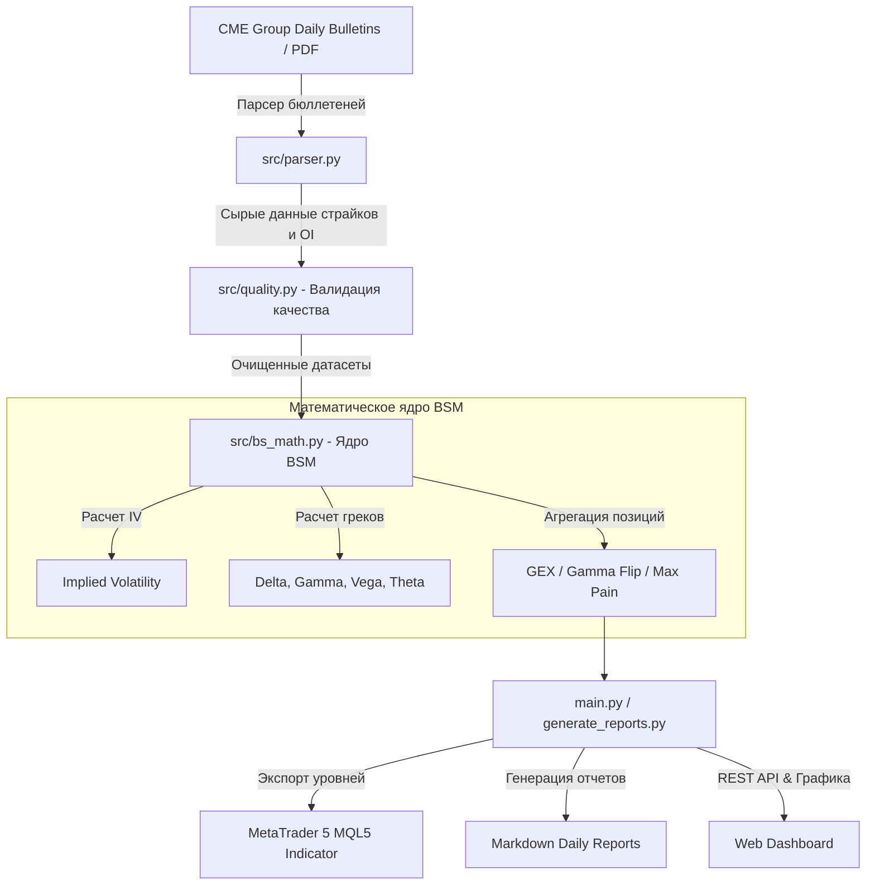

# 📊 Options — Аналитическая платформа для анализа опционов CME и расчета греков (BSM / GEX)

[](https://www.python.org/)
[](https://www.metatrader5.com/)
[](https://en.wikipedia.org/wiki/Black%E2%80%93Scholes_model)
[](https://deepmind.google/technologies/gemini/)
[](LICENSE)

**Options** — модульная количественная (quantitative) система для автоматического парсинга ежедневных опционных бюллетеней биржи **CME Group**, расчета параметров ценообразования опционов и профилей риска по модели **Блэка-Шоулза-Мертона (BSM)**, вычисления уровней **Gamma Exposure (GEX)**, **Gamma Flip**, **Max Pain**, а также генерации аналитических отчетов и выгрузки ключевых уровней в терминал **MetaTrader 5 (MQL5)** и веб-дашборд.

---

## 🚀 Основные возможности

* **Парсинг официальных бюллетеней CME Group:** автоматический сбор и обработка PDF/отчетов по опционным сериям (Daily Bulletin Section) для инструментов:
  * Валюты: **EUR/USD**, **GBP/USD**, **USD/CAD**
  * Металлы: **Золото (XAU/USD / GC)**
  * Фондовые индексы: **S&P 500 (SPX / ES)**, **Nasdaq-100 (NDX / NQ)**
  * Криптовалюты: **Bitcoin (BTC)**
* **Математическое ядро расчета «греков» (Greeks Engine):**
  * Подразумеваемая волатильность (**Implied Volatility / IV**) через оптимизацию Брента / метод Ньютона-Рафсона.
  * Расчет **Delta ($\Delta$)**, **Gamma ($\Gamma$)**, **Vega ($\nu$)**, **Theta ($\Theta$)**.
  * Расчет совокупного позиционирования маркетмейкеров: **Gamma Exposure (GEX)**, **Absolute Gamma**, точка перехода **Gamma Flip**, уровни максимальной боли (**Max Pain**).
* **Контроль качества данных (Quality Gate):** автоматическая валидация аномалий в страйках, открытом интересе (OI) и премиях по сравнению с историческими срезами.
* **Интеграция с MetaTrader 5 (MQL5):** экспорт рассчитанных уровней поддержки/сопротивления и страйков маркетмейкеров напрямую в индикаторы MT5.
* **ИИ-советник по хеджированию (LLM Advisor):** формирование ежедневных аналитических саммари в формате Markdown с контекстом рыночной фазы и рекомендациями по конструкциям хеджирования.
* **Интерактивный дашборд:** веб-интерфейс для визуализации профилей открытого интереса и распределения гаммы по страйкам.

---

## 📐 Архитектура и поток данных


```mermaid
flowchart TD
    A[CME Group Daily Bulletins / PDF] -->|Парсер бюллетеней| B[src/parser.py]
    B -->|Сырые данные страйков и OI| C[src/quality.py - Валидация качества]
    C -->|Очищенные датасеты| D[src/bs_math.py - Ядро BSM]
    
    subgraph MathEngine ["Математическое ядро BSM"]
        D -->|Расчет IV| E[Implied Volatility]
        D -->|Расчет греков| F[Delta, Gamma, Vega, Theta]
        D -->|Агрегация позиций| G[GEX / Gamma Flip / Max Pain]
    end
    
    G --> H[main.py / generate_reports.py]
    H -->|Экспорт уровней| I[MetaTrader 5 MQL5 Indicator]
    H -->|Генерация отчетов| J[Markdown Daily Reports]
    H -->|REST API & Графика| K[Web Dashboard]
```

---

## ⚙️ Математическая модель ценообразования (Black-Scholes-Merton)

Теоретическая стоимость европейских опционов Call ($C$) и Put ($P$) на базовые активы с непрерывной дивидендной/процентной доходностью $q$:

$$C(S, t) = S e^{-q t} N(d_1) - K e^{-r t} N(d_2)$$

$$P(S, t) = K e^{-r t} N(-d_2) - S e^{-q t} N(-d_1)$$

Где параметры $d_1$ и $d_2$:
$$d_1 = \frac{\ln(S/K) + \left(r - q + \frac{\sigma^2}{2}\right)t}{\sigma \sqrt{t}}, \quad d_2 = d_1 - \sigma \sqrt{t}$$

* $S$ — текущая спот-цена базового актива
* $K$ — цена страйка (Strike Price)
* $t$ — время до экспирации в долях года ($T / 365$)
* $r$ — безрисковая процентная ставка
* $q$ — дивидендная доходность / иностранная ставка
* $\sigma$ — подразумеваемая волатильность (Implied Volatility)

### Расчет Gamma ($\Gamma$) и Gamma Exposure (GEX):
$$\Gamma = \frac{e^{-q t} N'(d_1)}{S \sigma \sqrt{t}}$$

$$\text{GEX}_{\text{strike}} = \Gamma \times S \times \text{Contract Size} \times \text{Open Interest} \times \text{Multiplier}$$

---

## 🛠️ Структура проекта

```text
Options/
├── src/
│   ├── bs_math.py              # Математические формулы BSM, расчет греков и Gamma Flip
│   ├── parser.py               # Модуль парсинга PDF/текстовых бюллетеней CME
│   ├── expiry.py               # Календарь и сопоставление дат экспираций опционов
│   ├── product_config.py       # Спецификации контрактов (EUR, GBP, CAD, XAU, SPX, NAS, BTC)
│   ├── quality.py              # Валидация аномалий и проверка целостности данных
│   └── extract_gex_metrics.py  # Извлечение метрик экспозиции маркетмейкеров
├── Dashboard/                  # Веб-дашборд и генератор отчетов
├── tests/                      # Модульные и интеграционные тесты (pytest)
├── main.py                     # Основной скрипт запуска пайплайна
├── generate_reports.py         # Скрипт генерации ежедневных аналитических отчетов
├── requirements.txt            # Зависимости Python
└── README.md                   # Документация проекта
```

---

## 📥 Установка и запуск

### 1. Клонирование репозитория
```bash
git clone https://github.com/circlealgorythm/Options.git
cd Options
```

### 2. Создание виртуального окружения
С использованием `uv` (рекомендуется):
```bash
uv venv
.venv\Scripts\activate      # Windows PowerShell / CMD
# source .venv/bin/activate # Linux / macOS
```
Либо через стандартный `python -m venv`:
```bash
python -m venv .venv
.venv\Scripts\activate
```

### 3. Установка зависимостей
```bash
uv pip install -r requirements.txt
# или: pip install -r requirements.txt
```

---

## 🚦 Использование

### 1. Запуск основного пайплайна обработки
Парсинг доступных бюллетеней CME, расчет греков и экспорт уровней для MT5:
```bash
python main.py
```

### 2. Генерация ежедневных отчетов
Формирование аналитических Markdown-отчетов по всем активам:
```bash
python generate_reports.py
```

### 3. Запуск тестов
Проверка корректности математических формул и парсеров:
```bash
pytest tests/ -v
```

---

## 📊 Экспорт в MetaTrader 5 (MQL5)

По умолчанию расчетные уровни (Gamma Flip, Call/Put Walls, Max Pain) сохраняются в формате JSON/CSV в каталог файлов MT5:
`C:\Program Files\Wizense Global MT5 Terminal\MQL5\Files\GEX\`

Кастомный индикатор MQL5 считывает сгенерированные файлы и строит ключевые зоны опционной ликвидности прямо на графике в реальном времени.

---

## 📜 Лицензия
Проект распространяется под лицензией MIT. Подробности в файле `LICENSE`.
